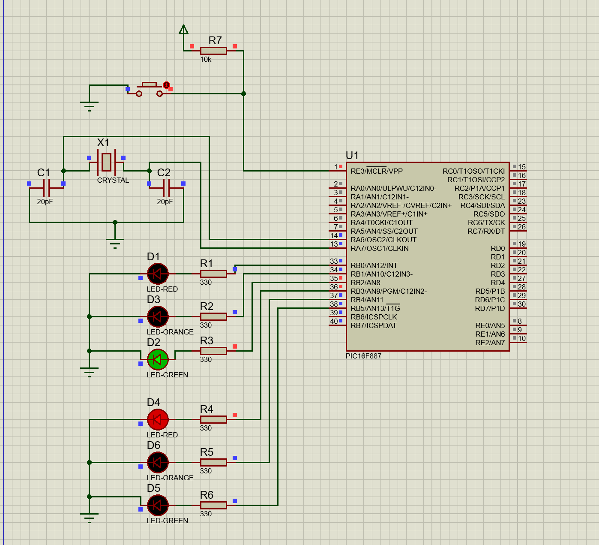
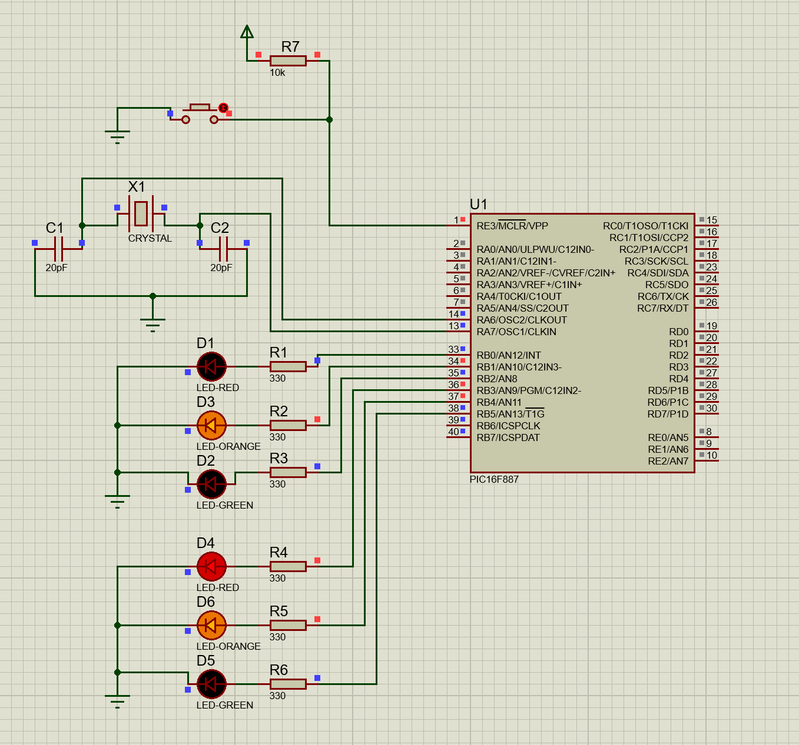
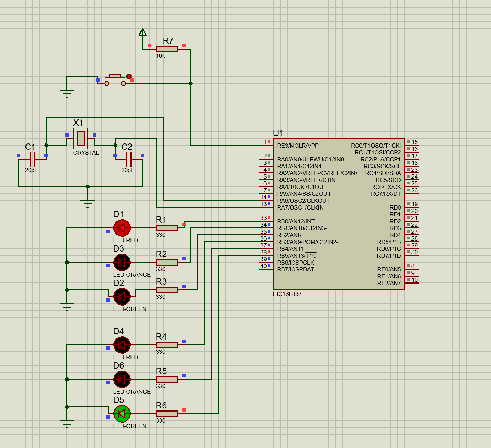
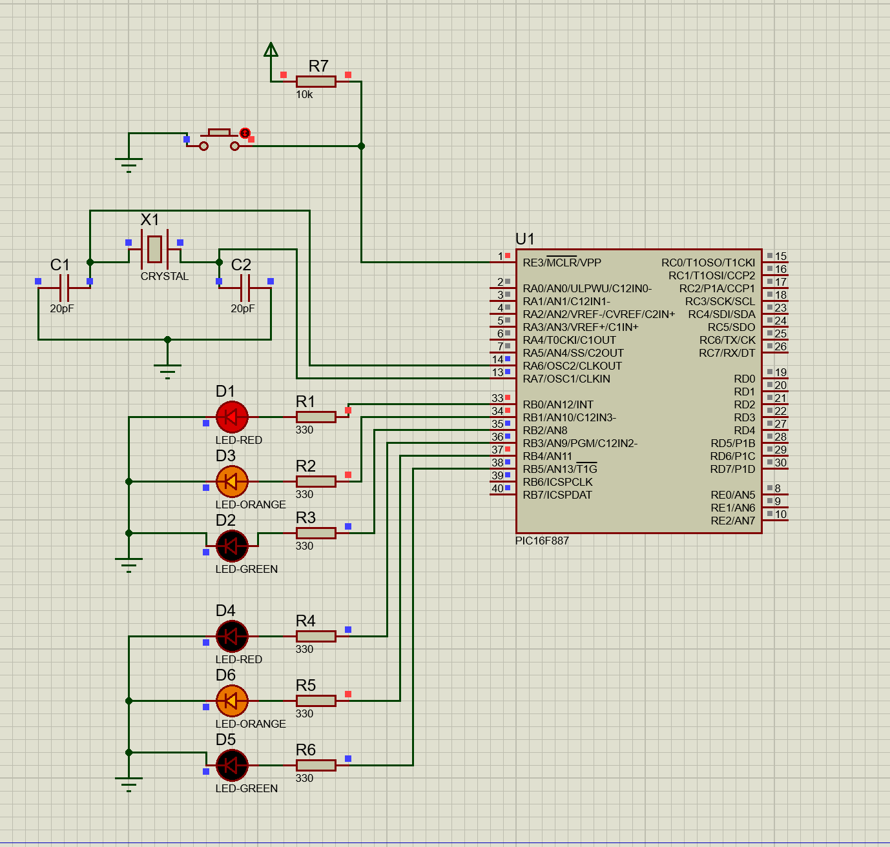

# Dual-Traffic-Light-Management

## Description
This project simulates two traffic lights at an intersection using a PIC16F887 microcontroller. The lights are coordinated to manage traffic flow efficiently.

## Circuit
### Green + Red Light
  

### Yellow + Yellow&Red Light
  

### Red + Green Light
  

### Yellow&Red + Yellow
  

*Circuit setup.*

## Timeline
  

## Files
- `two_traffic_light.pdsprj`: Circuit schematic for the traffic light system.
- `two_traffic_light.c`: MikroC program for managing two traffic lights.

## Instructions
1. Open `two_traffic_light.pdsprj` in Proteus.
2. Compile `two_traffic_light.c` in MikroC to generate the hex file.
3. Upload the hex file to Proteus and simulate the traffic light sequence.
4. Observe the dual traffic lights transitioning in a coordinated sequence.

## Tools
- MikroC Pro for PIC
- Proteus ISIS
